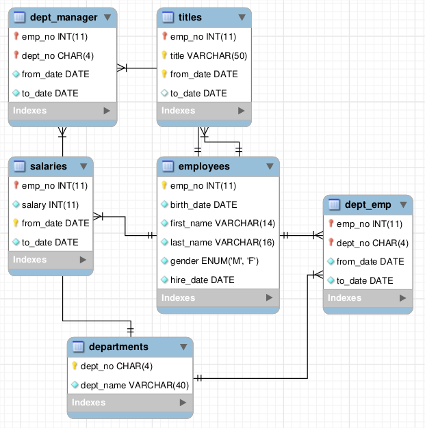

# graphql-compose-mysql

Automagically generate a GraphQL schema from a MySQL database.

As cherry on the cake, it will also:
* Create fields to make joins between tables (based on foreign keys detected)
* Use Facebook's [dataloader](https://github.com/facebook/dataloader) under the hood to drastically improve querying performance*

*: To avoid incoherent data, dataloaders' caching disabled, only batching feature used.

## Installation

```bash
yarn install graphql graphql-compose graphql-compose-mysql
```

Modules `graphql` and `graphql-compose`, are located in `peerDependencies`, so they should be installed explicitly in your app. They have global objects and should not have ability to be installed as submodules.

## Sample usage

```js
const { ApolloServer } = require("apollo-server")
const { composeWithMysql } = require("graphql-compose-mysql")

async function main() {
    return composeWithMysql({
        mysqlConfig: {
            host: "localhost",
            port: 3306,
            user: "root",
            password: "secret",
            database: "employees"
        },
    }).then(schema => {
        const server = new ApolloServer({
            schema: schema,
            playground: true,
        })

        server.listen().then(({ url }) => {
            console.log(`🚀 Server ready at ${url}`)
        })
    })
}

main()
```

`mysqlConfig` will be used internally to initialize a [mysql driver](https://github.com/mysqljs/mysql). See Available options [here](https://github.com/mysqljs/mysql#connection-options).

## Tests
## pre-requisites
Start the needed docker containers by issuing a `docker-compose up` in the /tests/ folder.

It will spin up a MySQL database exposed on the local port 3306 and load it up with employees data from [datacharmer/test_db](
https://github.com/datacharmer/test_db).

You will also get an [adminer](https://www.adminer.org/) GUI on the local port 8080.

## MySQL employees' database


## GraphQL schema generated
As you can see, join's fields between tables are also created.

```GraphQL
      type current_dept_empT {
        emp_no: Int
        dept_no: String
        from_date: Date
        to_date: Date
      }
      
      scalar Date
      
      type departmentsT {
        dept_no: String
        dept_name: String
      }
      
      type dept_emp_latest_dateT {
        emp_no: Int
        from_date: Date
        to_date: Date
      }
      
      type dept_empT {
        emp_no: Int
        dept_no: String
        from_date: Date
        to_date: Date
        departments(dept_name: String): [departmentsT]
        employees(birth_date: Date, first_name: String, last_name: String, gender: String, hire_date: Date): [employeesT]
      }
      
      type dept_managerT {
        emp_no: Int
        dept_no: String
        from_date: Date
        to_date: Date
        departments(dept_name: String): [departmentsT]
        employees(birth_date: Date, first_name: String, last_name: String, gender: String, hire_date: Date): [employeesT]
      }
      
      type employeesT {
        emp_no: Int
        birth_date: Date
        first_name: String
        last_name: String
        gender: String
        hire_date: Date
      }
      
      type Query {
        current_dept_emp(emp_no: Int, dept_no: String, from_date: Date, to_date: Date): [current_dept_empT]
        departments(dept_no: String, dept_name: String): [departmentsT]
        dept_emp(emp_no: Int, dept_no: String, from_date: Date, to_date: Date): [dept_empT]
        dept_emp_latest_date(emp_no: Int, from_date: Date, to_date: Date): [dept_emp_latest_dateT]
        dept_manager(emp_no: Int, dept_no: String, from_date: Date, to_date: Date): [dept_managerT]
        employees(emp_no: Int, birth_date: Date, first_name: String, last_name: String, gender: String, hire_date: Date): [employeesT]
        salaries(emp_no: Int, salary: Int, from_date: Date, to_date: Date): [salariesT]
        titles(emp_no: Int, title: String, from_date: Date, to_date: Date): [titlesT]
      }
      
      type salariesT {
        emp_no: Int
        salary: Int
        from_date: Date
        to_date: Date
        employees(birth_date: Date, first_name: String, last_name: String, gender: String, hire_date: Date): [employeesT]
      }
      
      type titlesT {
        emp_no: Int
        title: String
        from_date: Date
        to_date: Date
        employees(birth_date: Date, first_name: String, last_name: String, gender: String, hire_date: Date): [employeesT]
      }
```

## Run tests
After docker's containers are started, in root folder run:
```bash
yarn test
```

## License

[MIT](LICENSE.md)